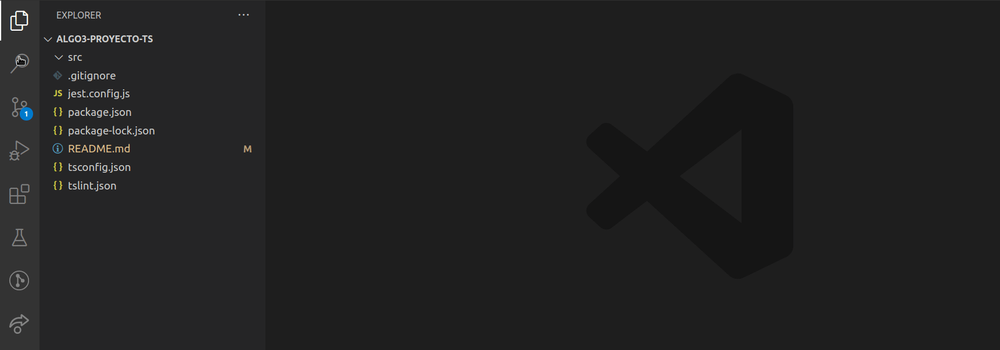
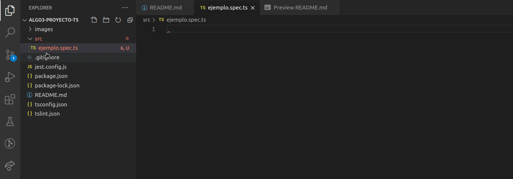
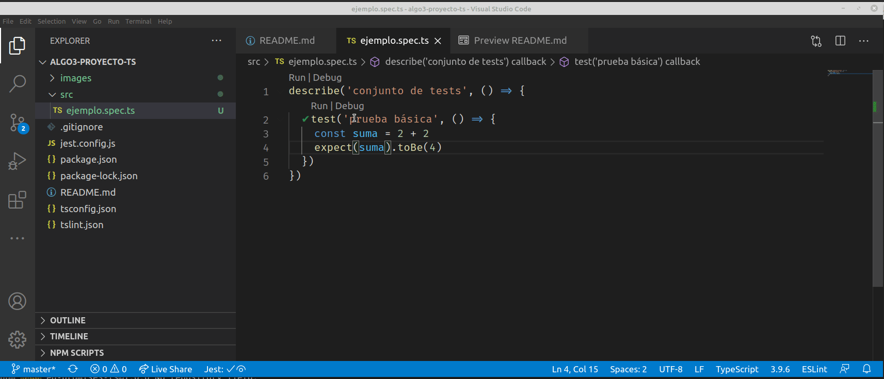
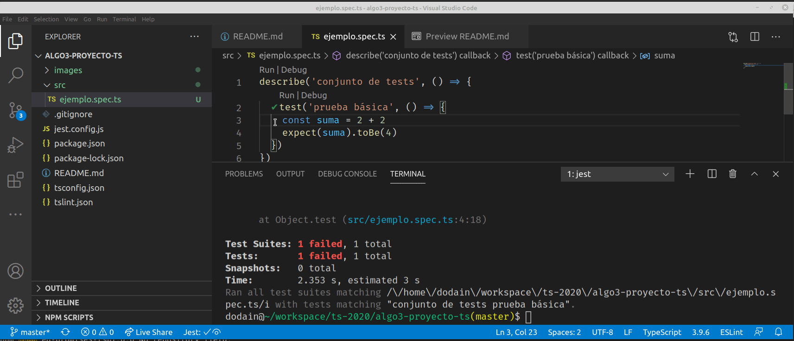

## Proyecto Typescript desde cero

- En la carpeta `src` podés comenzar a escribir tus archivos `.ts`.
- Los tests los escribís en el mismo directorio `src` pero con extensión `spec.ts`.

## Antes de empezar a usarlo

Ejecutá el siguiente comando

```bash
npm i
```

## Para editar el Proyecto

Podés ejecutar el Visual Studio Code desde el menú inicio o bien usando Git Bash hacés

```bash
code .
```

en el directorio donde está el proyecto.

Recordá que tu instalación de Visual Studio Code requiere las extensiones que están en [la página específica de Typescript del sitio Algoritmos 3](https://algo3.uqbar-project.org/herramientas/typescript). Y que se instalan de la siguiente manera:



## Para ejecutar los tests

### Plugin Jest

Podés usar el plugin `Jest` que los ejecuta dentro de tu editor:



### Plugin Jest Runner

El `Jest Runner` que te da la opción de ejecutar o debuggear un test (aunque ya podés ver el preview si tenés la extensión Jest):



También te permite debuggear y avanzar paso a paso con F10 con un simple botón derecho:



### Por línea de comando

Y por último, desde el Git Bash o la línea de comando:

```bash
npm test
```

## Para borrar archivos extras

Este proyecto tiene imágenes .gif y esta explicación en el README, si querés eliminarlos podés correr el script

```bash
npm clean
```

## Archivos de configuración

Estos son todos los archivos de configuración de tu proyecto:

- `tsconfig.json`: es el archivo de configuración de Typescript de tu proyecto, que indica a qué versión de Javascript se está transpilando, eso indica qué herramientas podemos usar (por ejemplo, los decoradores de JS vienen en la versión ES2017)
- `package.json`: indica las dependencias del proyecto, la versión semántica, entre otras cosas.
- `package-lock.json`: es importante subirlo a git, tiene las dependencias exactas y completas del proyecto.
- `jest.config.js`: es el archivo de configuración de Jest, el framework de testeo unitario que utilizamos.
- `tslint.json`: la configuración del _linter_, que es el proceso que valida la correctitud del código. Por ejemplo, si definimos una variable `let` y no cambiamos la referencia, el linter nos va a pedir que la cambiemos a una definición `const`.
